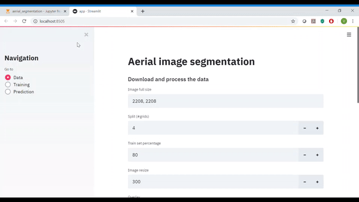

aerial_segmentation_challenge
==============================

Building segmentation model for aerial image

Project Organization
------------

    ├── LICENSE
    ├── Makefile           <- Makefile with commands like `make data` or `make train`
    ├── README.md          <- The top-level README for developers using this project.
    ├── apps               <- Streamlit webapp to run streamlit_aerial_segmentation.
    │   ├── app.py       
    │   ├── SessionState.py  
    ├── notebook               <- Jupyter notebook to run replicate the process.
    │   ├── aerial_segmentation.ipynb       
    │   ├── external       <- Data from third party sources.
    │   ├── interim        <- Process the data from raw by splitting them into 4x4 grid and segregate them into images and labels 
    │   ├── processed      <- Prepare train and test for model building.
    │   └── raw            <- Download and unzip the city data.
    │
    ├── docs               <- A default Sphinx project; see sphinx-doc.org for details
    │
    ├── models             <- Trained and serialized models, model loss, or model summaries. Arranged by datetimestamp directories.
    │
    │
    ├── references         <- Data dictionaries, manuals, and all other explanatory materials.
    │
    ├── reports            <- Save evaluation report of test set.
    │   └── figures        <- Generated graphics and figures to be used in reporting
    │
    ├── requirements.txt   <- The windows requirements file for reproducing the analysis environment, e.g.
    │                         generated with `pip freeze > requirements.txt`
    ├── requirements_linux.txt   <- The linux requirements file for reproducing the analysis environment, e.g.
    │                         generated with `pip freeze > requirements.txt`
    │
    ├── setup.py           <- makes project pip installable (pip install -e .) so src can be imported
    ├── src                <- Source code for use in this project.
    │   ├── __init__.py    <- Makes src a Python module
    │   │
    │   ├── data           <- Scripts to download or generate data
    │   │   └── make_dataset.py
    │   │   └── prepare_dataset.py
    │   │
    │   ├── features       <- Scripts to turn raw data into features for modeling
    │   │
    │   ├── models         <- Scripts to train models and then use trained models to make
    │   │   │                 predictions
    │   │   ├── data_factory.py
    │   │   └── evaluate_model.py
    │   │   ├── metrics.py
    │   │   └── Unet.py
    │   │   ├── predict_model.py
    │   │   └── train_model.py
    │   │
    │   └── visualization  <- Scripts to create exploratory and results oriented visualizations
    │
    └── tox.ini            <- tox file with settings for running tox; see tox.testrun.org
    ├── config.json        <- config file to support the user defined inputs
    ├── streamlit_aerial_segmentation.gif        <- Demo of streamlit app
    ├── streamlit_aerial_segmentation.mp4        <- Demo of streamlit app

--------

Steps to run the Audi challenge boiler plate notebook  (```audi_it_ml_challenge.ipynb```):

1. Create a virtual environment with the command
     ```
     conda create -n audi python=3.7
     ```
2. Activate the environment with the command
    ```
    conda activate audi
    ```
3. Install the nb_conda_kernel to enable virtual env in the notebook
    ```
    conda install nb_conda_kernels 
    ```

4. Install the required libraries

    for windows
    ```
    pip install -r requirements.txt
    ```
    for linux
    ```
    pip install -r requirements_linux.txt

5. Start the jupyter notebook from the project home directory 
    ```
    jupyter notebook
    ```
6. Open the notebook ```audi_it_ml_challenge.ipynb``` from the jupyter notebook and make sure the kernel is set to ```audi```

7. Use the ```config.json``` file in project home directory to define the data and training related parameters.

8. Each cell is self explanatory. To replicate, jun run all the cells. 

9. ```Streamlit``` webapp developed and included to run this entire application through web

**please note there will be a difference in the result on each run of the notebook due to randomness in the train and test set preparation.**

--------

Steps to run the Audi challenge boiler plate via terminal:

1. Create a virtual environment with the command
     ```
     conda create -n audi python=3.7
     ```
2. Activate the environment with the command
    ```
    conda activate audi
    ```
3. Install the nb_conda_kernel to enable virtual env in the notebook
    ```
    conda install nb_conda_kernels 
    ```

4. Install the required libraries

    for windows
    ```
    pip install -r requirements.txt
    ```
    for linux
    ```
    pip install -r requirements_linux.txt
    ```

5. Use the ```config.json``` file in project home directory to define the data and training related parameters.

6. To download and process the dataset
```
    (audi)project_home_directory$: python src/data/make_dataset.py
```
7. To prepare train and test set
```
    (audi)project_home_directory$: python src/data/prepare_dataset.py
```
8. To start the training
```
    (audi)project_home_directory$: python src/models/train_model.py
```
The trained model will get saved in ```project_home_directory/models/<datetimestamp>/trained_model_end.pth```

9. To perform the evaluation on test set after training
```
    (audi)project_home_directory$: python src/models/evaluate_model.py
```

The evaluation result will get saved in ```project_home_directory/reports/<datetimestamp>/eval_results.txt```


10. To do the prediction for new image
```
    (audi)project_home_directory$: python src/models/predict_model.py <model checkpoint path> <image path> <outfile path>
```
Example
```
    (audi)project_home_directory$: python src/models/predict_model.py "models/20200415-152052/trained_model_end.pth" "data/raw/berlin/berlin5_image.png" "reports/figures/predict_berlin5_mask.png"
```

-------

Steps to run the Audi challenge boiler plate via streamlit webapp:

1. Create a virtual environment with the command
     ```
     conda create -n audi python=3.7
     ```
2. Activate the environment with the command
    ```
    conda activate audi
    ```
3. Install the nb_conda_kernel to enable virtual env in the notebook
    ```
    conda install nb_conda_kernels 
    ```

4. Install the required libraries

    for windows
    ```
    pip install -r requirements.txt
    ```
    for linux
    ```
    pip install -r requirements_linux.txt
    ```

5. start the streamlit app

```
(audi)project_home_directory$: streamlit apps/app.py
```

**Please note streamlit app can also be launced via Audi challenge boiler plate notebook**



